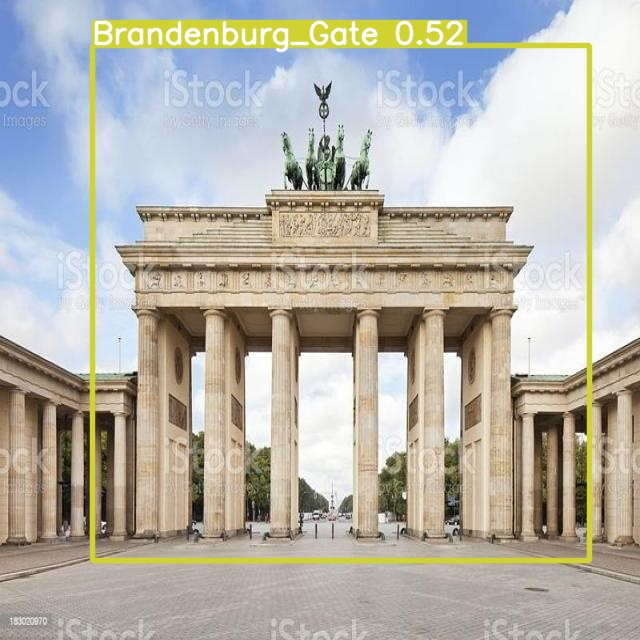
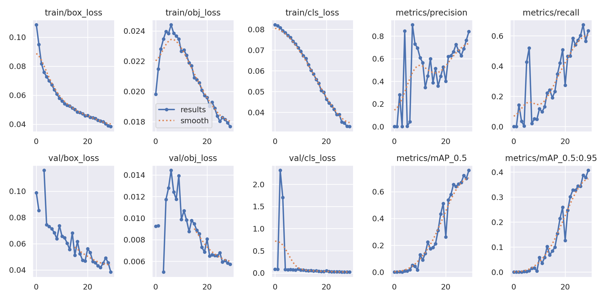
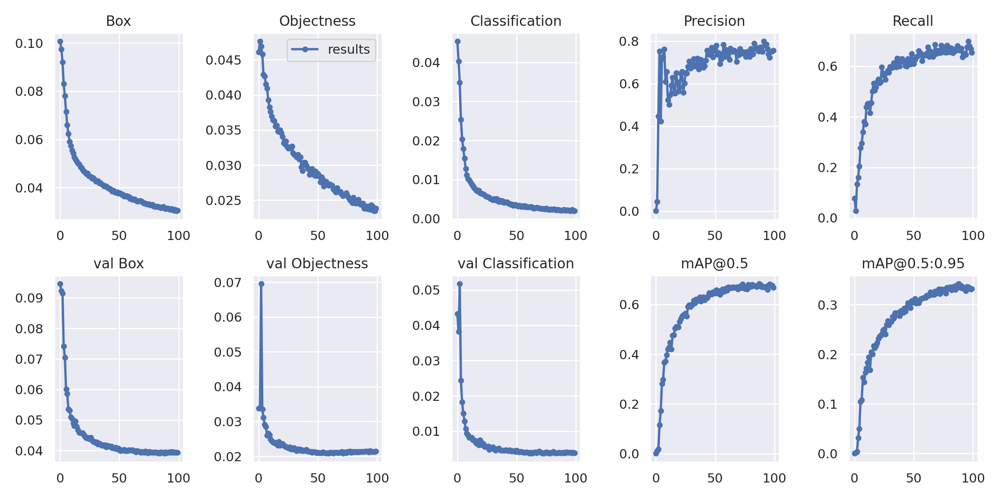

# Tourist Landmark Detection Using YOLO



## Project Overview

This project aims to develop a cutting-edge object detection system that identifies tourist landmarks in images or video streams. Leveraging the YOLO (You Only Look Once) algorithm, our goal is to enhance the travel experience by providing instant information about landmarks, facilitate urban navigation, and support local economies through increased tourism.

## Motivation

- **Enhance Tourist Experience:** Automatically identify landmarks to provide tourists with information and insights.
- **Urban Navigation:** Aid city residents and visitors in discovering and exploring local landmarks.
- **Cultural Preservation:** Promote awareness and conservation of historical and cultural sites.
- **Economic Development:** Drive tourism and local business growth by highlighting landmarks.

# Install dependencies

```
pip install -r requirements.txt
```

## Dataset

### Sources

- **Roboflow:** 50% of our dataset comes from Roboflow, offering diverse images of landmarks under various conditions.
- **Google Images:** The remaining 50% were manually curated from Google Images to include a wide array of landmarks not present in the Roboflow dataset.

### Quantity Dataset

| Source          | Image Resolution |
|-----------------|------------------|
| Roboflow Images | 1200             |
| Downloaded Images | 300            |


### Annotation
- **Augmentation**  To further enhance the dataset's diversity and robustness, data augmentation techniques such as flipping, rotation, and scaling were applied. This step helps in reducing overfitting and improving the model's perforsmance on unseen  images.
- **To install**: ```pip install augmentor```
- **Notebook of data augmentation**: [Augmentation Notebook](https://github.com/atikul-islam-sajib/UrbanTech-LandmakDetect/blob/main/Augmentation_Notebook/Augmentor.ipynb).


### Annotation

- **Tool Used:** Annotations were performed manually using Labelme, an intuitive graphical image annotation tool.
- **Process:** Each image was annotated by drawing precise bounding boxes around landmarks and labeling them with their names. This meticulous process ensures the high accuracy of our training dataset.
- **Preparation:** Images were preprocessed to fit YOLO's input requirements, including resizing and normalization. Data augmentation techniques such as flipping and rotation were applied to enhance model robustness.

## State of the Art

We utilize the YOLO algorithm for real-time object detection, chosen for its balance between speed and accuracy. The project explores the latest advancements in YOLO technology, ensuring our model is at the forefront of object detection capabilities.

#### Check the model train - Yolo v5:

| Epochs | Batch Size | Data Augmentation & Annotation | mAP     |
|--------|------------|--------------------------------|---------|
| 50     | 16         | No                             | < 0.50  |
| 50     | 64         | Yes                            | > 0.75  |


##### Model Performance without augmented dataset



##### Model Performance with augmented dataset + annotation manually



## Model Performance

Model Performance: visit the -> [Model Performance](https://github.com/labelmeai/labelme).

## Importance

This project stands at the intersection of technology and urban exploration, offering a tool that enhances the way we interact with our cities and their rich cultural landscapes. By making landmark detection accessible and instant, we contribute to sustainable tourism, urban development, and the global appreciation of cultural heritage.


## Usage

(Provide examples of how to use the application, including any relevant commands or scripts.)

## Contributing

(Outline how others can contribute to the project, including coding standards, commit message guidelines, and contact information for submitting pull requests.)

## License

(Specify the license under which the project is released, if applicable.)

## Acknowledgments

- Thanks to Roboflow and Google Images for providing the datasets.
- Appreciation to the developers of Labelme for their excellent annotation tool.
